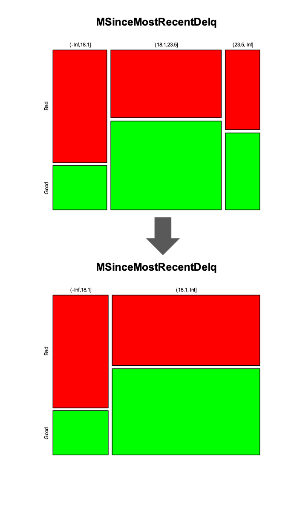
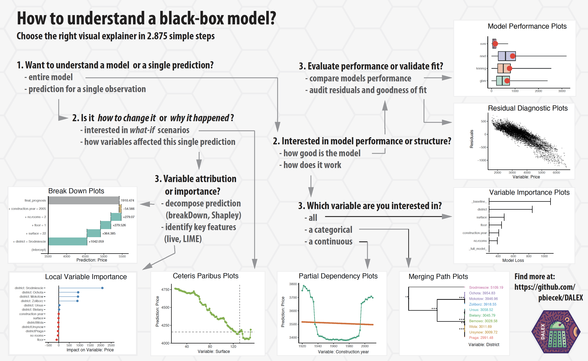

class: title-slide

<br><br><br>
# Transparency of 
# Machine Learning Models 
# in Credit Scoring
 

## CRC Conference XVI

<br> 
### Michael Bücker, Gero Szepannek, Przemyslaw Biecek, 
### Alicja Gosiewska and Mateusz Staniak

<br> 
#### 28 August 2019
---


```{r, load_refs, include=FALSE, cache=FALSE}
library(RefManageR)
BibOptions(check.entries = FALSE,
           bib.style = "authoryear",
           cite.style = "authoryear",
           style = "markdown",
           hyperlink = FALSE,
           max.names = 5,
           dashed = FALSE)
myBib <-ReadBib("./Bib.bib", check = FALSE)
```

layout: true

```{r setup, include=FALSE}
options(htmltools.dir.version = FALSE)
```

<div class="my-footer"> Transparency of Machine Learning Models in Credict Scoring | Michael Bücker | CRC Converence XVI </div>       


---

class: inverse
# Introduction


---

# Introduction

### Michael Bücker
Professor of Data Science  at Münster School of Business  
<br>

<br>
<div align = "center">

</div>

---

# Introduction

+ Main requirement for Credit Scoring models: provide a risk prediction that is **as accurate as possible**
+ In addition, regulators demand these models to be **transparent and auditable**
+ Therefore, very **simple predictive models** such as Logistic Regression or Decision Trees are still widely used `r citeNatbib(bib = myBib, keys = c("les15ben", "bis2014onc"), abbreviate = TRUE, textual = FALSE)` `r NoCite(bib = myBib, "les15ben", "bis2014onc")`
+ Superior predictive power of modern **Machine Learning algorithms** cannot be fully leveraged
+ A lot of **potential is missed**, leading to higher reserves or more credit defaults  `r citeNatbib(bib = myBib, keys = "sze2017ont")` `r NoCite(bib = myBib, "sze2017ont")`

---

# Research Approach

+ For an open data set we build a traditional and still state-of-the-art Score Card model 
+ In addition, we build alternative Machine Learning Black Box models
+ We  use model-agnostic methods for interpretable Machine Learning to showcase transparency of such models
+ For computations we use R and respective packages 
`r citeNatbib(bib = myBib, keys = c("bie2018dal", "mol2018iml"), abbreviate = TRUE, textual = FALSE)` `r NoCite(bib = myBib, "bie2018dal", "mol2018iml")`


---


# The incumbent: Score Cards

.pull-left70[
Steps for Score Card construction using Logistic Regression 
`r citeNatbib(bib = myBib, keys = c("sze2017afr"))` `r NoCite(bib = myBib, "sze2017afr")`

1. Automatic binning
2. Manual binning
3. WOE/Dummy transformation
4. Variable shortlist selection 
5. (Linear) modelling and automatic model selection
6. Manual model selection 
]


.pull-right70[


]
---

# The incumbent: Score Cards

.pull-left70[
Steps for Score Card construction using Logistic Regression 
`r citeNatbib(bib = myBib, keys = c("sze2017afr"))` `r NoCite(bib = myBib, "sze2017afr")`

1. Automatic binning
2. <a>Manual binning</a>
3. WOE/Dummy transformation
4. Variable shortlist selection 
5. (Linear) modelling and automatic model selection
6. Manual model selection 
]


.pull-right70[
<div align = "center">

</div>
]
---

# Score Cards: Manual binning

.pull-left70[
Manual binning allows for

+  (univariate) non-linearity
+  (univariate) plausibility checks
+  integration of expert knowledge for binning of factors  

<a>...but: only univariate effects (!)</a>

]

--
.pull-right70[
... and means a lot of manual work
<div align = "center">

</div>
]

---
# The challenger models

.pull-left[
We tested a couple of Machine Learning algorithms ...

+ Random Forests (`randomForest`)
+ Gradient Boosting (`gbm`)
+ XGBoost (`xgboost`)
+ Support Vector Machines (`svm`)
+ Logistic Regression with spline based transformations (`rms`)
]

.pull-right[
... and also two AutoML frameworks to beat the Score Card

+ [h2o AutoML](http://docs.h2o.ai/h2o/latest-stable/h2o-docs/automl.html) (`h2o`)
+ [mljar.com](https://mljar.com/) (`mljar`)
]
---
# Data set for study: xML Challenge by FICO

.pull-left70[
+ Explainable Machine Learning Challenge by `r citeNatbib(bib = myBib, keys = "fic2018xml", textual = TRUE)` `r NoCite(bib = myBib, "fic2018xml")`
+ Focus: Home Equity Line of Credit (HELOC) Dataset
+ Customers  requested a credit line in the range of $5,000 - $150,000
+ Task is to predict whether they will repay their HELOC account within 2 years
+ Number of observations: 2,615
+ Variables: 23 covariates (mostly numeric) and 1 target variable (risk performance "good" or "bad")
]

.pull-lright70[

<br>
<a href = "https://community.fico.com/s/explainable-machine-learning-challenge">
<div align = "right">

</div>
<a>
<br><br>
<a href = "https://www.fico.com/">
<div align = "right">

</div>
<a>
]

---

# Explainability of Machine Learning models

.pull-left70[
There are many model-agnostic methods for interpretable ML today; see `r citeNatbib(bib = myBib, keys = "mol2019int", textual = TRUE)` `r NoCite(bib = myBib, "mol2019int")` for a good overview.

+ Partial Dependence Plots (PDP)
+ Individual Conditional Expectation (ICE)
+ Accumulated Local Effects (ALE)
+ Feature Importance
+ Global Surrogate and Local Surrogate (LIME)
+ Shapley Values
+ ...
]

.pull-right70[
<div class = "wrap2">
<iframe class = "frame2"  src="https://christophm.github.io/interpretable-ml-book/"></iframe>
</div>
]
---

# Implementation in R: DALEX


.pull-left70[
<div align = "center">

</div>
]

.pull-right70[
+ Descriptive mAchine Learning EXplanations
+ DALEX is a set of tools that help to understand how complex models are working
]


---
class: inverse
# Results: Model performance

---


# Results: Comparison of model performance

.pull-left70[
```{r echo=FALSE, error=FALSE, fig.width=7, fig.height = 5, message=FALSE, warning=FALSE,  out.width=1200, fig.fullwidth=TRUE, dpi = 900}
library(openxlsx)
fico_benchmark <- read.xlsx("FICO_challenge/FICO_benchmark.xlsx",1)

fico_benchmark <- fico_benchmark[-5,]
fico_benchmark <- fico_benchmark[order(fico_benchmark$test, decreasing = TRUE),]

library(ggrepel)
library(plotly)
library(purrr)
library(RColorBrewer)

cols <- character(9L)
cols[-7] <- brewer.pal(9, "Greys")[2:9]
cols[7] <- "#E41A1C"

fico_benchmark$FICO[5] <- "Score Card"
fico_benchmark$type[5] <- "Score Card"


b <- 
ggplot(fico_benchmark, aes(x = reorder(FICO,-test), y = test, fill = type)) +
  geom_bar(stat="identity") +
  coord_cartesian(ylim = c(.75, .8)) +
  scale_fill_manual(values=cols) +
  theme_light() +
  theme(axis.text.x = element_text(angle = 90, vjust = 0.75)) + 
  xlab("Models") + 
  ylab("AUC on test data set")

b


```
]

.pull-right70[
+ Predictive power of the traditional Score Card model surprisingly good
+ Logistic Regression with spline based transformations best, using `rms` by `r citeNatbib(bib = myBib, keys = "rms2019reg", textual = TRUE)` `r NoCite(bib = myBib, "rms2019reg")`
]
---

# Results: Comparison of model performance

.pull-left70[
<br>
```{r echo=FALSE, error=FALSE, fig.width=12, message=FALSE, warning=FALSE,  out.width=1000}

cols <- character(21L)
cols[-c(2,19,17)] <- brewer.pal(9, "Greys")[9]
cols[c(2,19,17)] <- "#E41A1C"


b <- ggplot(fico_benchmark, aes(x = train, y = test, color = FICO, label = FICO)) +
  geom_point(stat="identity") +
  theme_light() +
  geom_text_repel(size = 5) +
  theme(legend.position = "none", text = element_text(size=20)) +
  scale_colour_manual(values=cols) +
  xlab("AUC on training data set") + 
  ylab("AUC on test data set") + 
  geom_abline(slope = 1, intercept = 0) +ylim(.75, .825) + xlim(.75,1)
b
```
]

.pull-right70[
For comparison of explainability, we choose 

+ the Score Card, 
+ a Gradient Boosting model with 10,000 trees, 
+  a tuned Logistic Regression with splines using 13 variables
]


---
class: inverse
# Results: Global explanations

---


# Score Card: Variable importance as range of points
.pull-left70[
```{r echo=FALSE, error=FALSE, fig.width=7, fig.height = 5, message=FALSE, warning=FALSE,  out.width=1200, fig.fullwidth=TRUE, dpi = 900}
library(readr)
score_range <- read_csv("score_range.csv")
ggplot(score_range, aes(x = reorder(Model, range), y = range)) +
  geom_bar(stat="identity") + 
  theme_light() +
  theme(axis.text.x = element_text(angle = 90, vjust = 0.75)) + 
  xlab("Models") + 
  ylab("Range of Score Card points") + 
  coord_flip()
```
]


.pull-right70[

+ Range of Score Card point as an indicator of relevance for predictions
+ Alternative: variance of Score Card points across applications

]
---
# Model agnostic: Importance through drop-out loss

.pull-left70[
```{r echo=FALSE, error=FALSE, fig.width=7, fig.height = 5, message=FALSE, warning=FALSE,  out.width=1200, fig.fullwidth=TRUE, dpi = 900}

load("FICO_challenge/vp.rds")
library(ingredients)
library(ggplot2)
plot(vp_gbm, bar_width = 2) + ylab("1 - AUC") + theme_light() + theme(legend.position = "none") + ggtitle("","")
```
]

.pull-right70[

+ The drop in model performance (here AUC) is measured after permutation of a single variable
+ The more siginficant the drop in performance, the more important the variable

]


---
# Score Card: Variable explanation based on points

.pull-left70[
<br>
```{r echo=FALSE, error=FALSE, fig.width=7, fig.height = 4, message=FALSE, warning=FALSE,  out.width=1200, fig.fullwidth=TRUE, dpi = 900}
library(dplyr)
ext_risk <- tibble(`Score Card Points` = c(-11,-11,-2,-2,5,5,14,14), 
                   ExternalRiskEstimate = c(50,67.1, 67.1, 72.6,72.6, 81.3,81.3, 100))

b <- ggplot(data = ext_risk, aes(x = `ExternalRiskEstimate`, y = `Score Card Points`)) +
  geom_line()+ 
  theme_light() + 
  xlab("ExternalRiskEstimate") + 
  ylab("Score Card Points") +
  ylim(-20, +20)
b
```
]

.pull-right70[

+ Score Card points for values of covariate show effect of single feature
+ Directly computed from coefficient estimates of the Logistic Regression

]

---
# Model agnostic: Partial dependence plots

.pull-left70[
```{r echo=FALSE, error=FALSE, fig.width=7, fig.height = 5, message=FALSE, warning=FALSE,  out.width=1200, fig.fullwidth=TRUE, dpi = 900}
load(file = "FICO_challenge/extrisk.rds")

plot(cp_score_card, cp_lmr_13_tuned, cp_gbm_10000, 
     color = "_label_") + 
  theme_light() + theme(legend.position = "bottom") +
  ylab("Average prediction") + 
  ggtitle("","")
```
]

.pull-right70[

+ Partial dependence plots created with `r citeNatbib(bib = myBib, keys = c("bie2018dal"), abbreviate = TRUE, textual = FALSE)` `r NoCite(bib = myBib, "bie2018dal")`
+ Interpretation very similar to marginal Score Card points

]

---
class: inverse
# Results: Local explanations

---
# Instance-level explanations

.pull-left70[
+ Instance-level exploration helps to understand how a model yields a prediction for a single observation
+ Model-agnostic approaches are 
  + additive Breakdowns
  + Shapley Values 
  + LIME
+ In Credit Scoring, this explanation makes each credit decision transparent
]

.pull-right70[
]
---
# Score Card: Local explanations

.pull-left70[
```{r echo=FALSE, error=FALSE, fig.width=7, fig.height = 5, message=FALSE, warning=FALSE,  out.width=1200, fig.fullwidth=TRUE, dpi = 900}
load(file = "FICO_challenge/loc_points.rds")
cols <- ifelse(loc_points$Points>=0,"#008000","#E41A1C")[order(loc_points$Variable)]

ggplot(loc_points, aes(y = Points, x = reorder(Variable, Points), fill = Variable)) + 
  geom_bar(stat="identity") + 
  theme_light() +
  scale_fill_manual(values=cols) +
  theme(axis.text.x = element_text(angle = 90, vjust = 0.75), legend.position = "none") + 
  xlab("Variables") + 
  ylab("Score Card points") + 
  coord_flip()
```
]

.pull-right70[
+ Instance-level exploration for Score Cards can simply use individual Score Card points 
+ This yields a breakdown of the scoring result by variable

]

---

# Model agnostic: Variable contribution break down

.pull-left70[
```{r echo=FALSE, error=FALSE, fig.width=7, fig.height = 5, message=FALSE, warning=FALSE,  out.width=1200, fig.fullwidth=TRUE, dpi = 900}
library(iBreakDown)
load("FICO_challenge/breakdown.rds")
p1 <- plot(bd_lmr_13_tuned) + theme_light() + theme(legend.position = "none")
p2 <- plot(bd_gbm_10000) + theme_light() + theme(legend.position = "none")
p3 <- plot(bd_score_card) + theme_light() + theme(legend.position = "none")
# grid.arrange(p1, p2, p3)
p2
```
]

.pull-right70[
+ Such instance-level explorations can also be performed in a model-agnostic way
+ Unfortunately, for non-additive models, variable contributions depend on the ordering of variables
]


---

# Model agnostic: Shapley values

.pull-left70[
```{r echo=FALSE, error=FALSE, fig.width=7, fig.height = 5, message=FALSE, warning=FALSE,  out.width=1200, fig.fullwidth=TRUE, dpi = 900}
library(iBreakDown)
load("FICO_challenge/shapley.rds")
p1 <- plot(sh_lmr_13_tuned) + theme_light() + theme(legend.position = "none")
p2 <- plot(sh_gbm_10000) + theme_light() + theme(legend.position = "none")
p3 <- plot(sh_score_card) + theme_light() + theme(legend.position = "none")
p2 
# grid.arrange(p1, p2, p3)
```
]

.pull-right70[
+ Shapley attributions are averages across all (or at least large number) of different orderings
+ Violet boxplots show distributions for attributions for a selected variable, while length of the bar stands for an average attribution
]


---
class: inverse
# Conclusion

---

# Modeldown: HTML summaries for predictive Models 

Rf. `r citeNatbib(bib = myBib, keys = "bie2019mod", textual = TRUE)` `r NoCite(bib = myBib, "bie2019mod")`

.pull-left70[
<div class = "wrap">
<iframe class = "frame"  src="https://buecker.netlify.com/modeldown"></iframe>
</div>
]

.pull-right70[
<a>
<div align = "center">

</div>
</a>
]
---

# Conclusion

+ We have built models for Credit Scoring using Score Cards and Machine Learning
+ Predictive power of Machine Learning models was superior (in our example only slightly, other studies show clearer overperformance)
+ Model agnostic methods for interpretable Machine Learning are able to meet the degree of explainability of Score Cards and may even exceed it

---
# References (1/3)

```{r refs, echo=FALSE, results="asis"}
PrintBibliography(myBib, start = 1, end = 4)
```

---

# References (2/3)

```{r refs2, echo=FALSE, results="asis"}
PrintBibliography(myBib, start = 5, end = 8)
```

---

# References (3/3)

```{r refs3, echo=FALSE, results="asis"}
PrintBibliography(myBib, start = 9)
```

---

# Thank you!

<br> 


.smaller-font[
.pull-left[
#### Prof. Dr. Michael Bücker  
Professor of Data Science  
Münster School of Business  

FH Münster - University of Applied Sciences -  
Corrensstraße 25, Room C521  
D-48149 Münster  

Tel: +49 251 83 65615  
E-Mail: michael.buecker@fh-muenster.de  
http://prof.buecker.ms
]

.pull-right[
<a>
<div align = "center">

</div>
</a>
]
]

<!-- --- -->

<!-- class: inverse -->
<!-- # Backup -->


<!-- --- -->
<!-- class: empty -->
<!-- background-image: url("https://media.giphy.com/media/lqVVqkqMolh9S/giphy.gif") -->
<!-- background-size: contain -->


